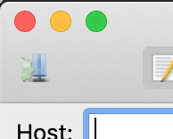
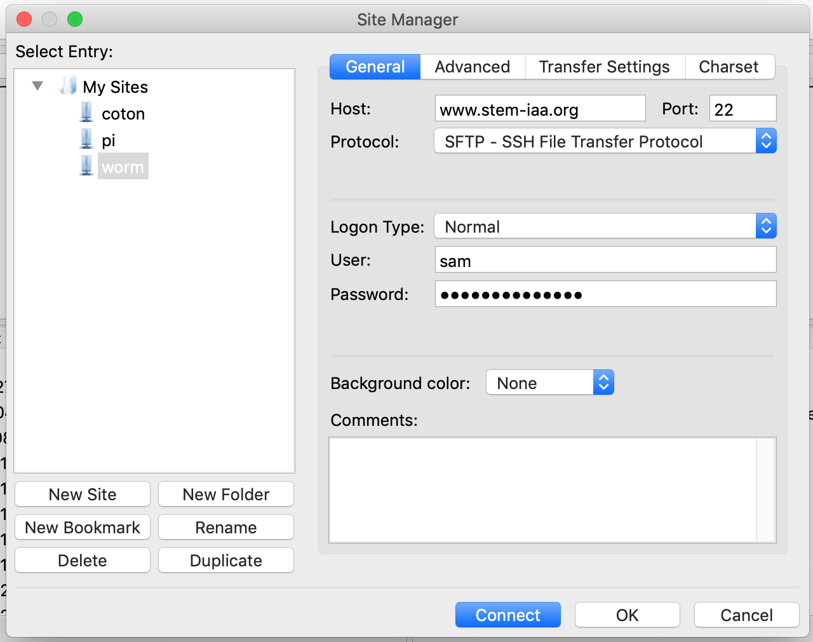

# Student Getting Started Guide

## Setting up your account

### Logging in

First, navigate to [www.stem-iaa.org](https://www.stem-iaa.org). The [Chrome web browser](https://www.google.com/chrome/) is officially supported.

Then, click `Login` at the top right. Your account has already been created with the following credentials:

<div>Username: <mark>username</mark></div>
<div>Password: <mark>password</mark></div>
<br>

You will then be taken to your profile. This page can be seen by other students, as well as your mentors/instructors.

### Editing your info

By default, your profile contains some generic content. Start by modifying the content on your profile by clicking `Edit` at the top right.

Enter some information about yourself in the bio text box. In the future, you may update your portfolio with the work you've accomplished in the class. For now, simply write whatever you want here. Then, click the default profile picture and upload one of your own.

When you've finished, click `Save` at the top right.

Next, go to your account settings by clicking your username dropdown at the top right, and then navigating to `Account`. Here you may update any missing information that you desire.

## Course Information

### Connecting to your virtual machine

During this class, you will be completing assignments on a virtual machine. To connect to your VM, click the username dropdown at the top right and then navigate to `Course Information`.

Click the `Start VM` button on the right, under `Connect to VM`. Wait for your VM to startup, and then click the `Connect to VM` button when it appears. On the new page that opens, click `Connect`.

### Viewing cohort information

Your instructors and mentors are displayed on the front of your course information page. Click any of their usernames to view their profile.

If you wish to view an entire cohort, click the desired cohort on the right under `Cohorts`.

## Hosting

You are provided with two types of hosting: static file hosting and flask application hosting. You may host static files (such as HTML, PHP, images, etc) using the w3.stem-iaa.org service. For flask applications you will use the flask.stem-iaa.org service.

### Static file hosting

To upload a static file, use an FTP client such as FileZilla (provided on your VM). First, click `Site Manager` at the top left.



Create a new site and set `www.stem-iaa.org` as the url, and set your portal username and password as the account credentials.



Also, make sure the protocol is set to `SFTP` rather than `FTP`.

Then, drag your static files to the `~/www/html` folder. You can access the file by navigating to `your_username.w3.stem-iaa.org/your_file.html`.

### Flask application hosting

To host a flask application, ssh into `www.stem-iaa.org` with your portal username and password. `cd` to `~/www`, then remove the symlink named `flask` and replace it with a directory with the same name. Then, create a file called app.py with a flask app inside named `app`. For example:

```py
from flask import Flask

app = Flask(__name__)
```
Your flask app should be written using this file. After changing the directory structure of your flask app, execute `touch ~/www/flask_reload` to update your changes. Changes to the python code itself will be updated automatically.
